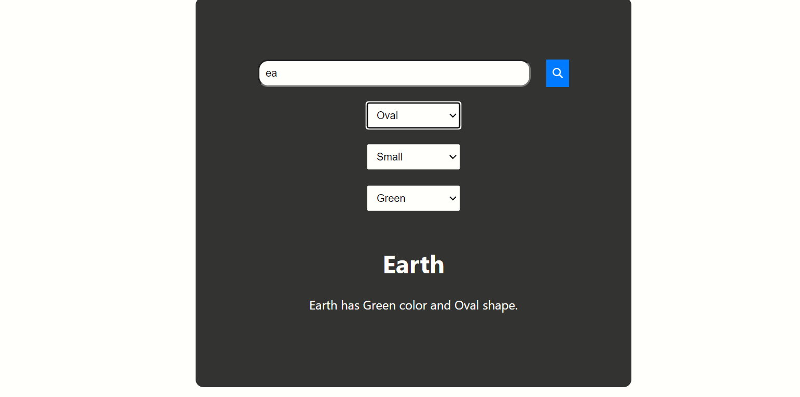

# PlanetList

Welcome to PlanetList! This is a React application that allows users to explore various planets, their shapes, sizes, and colors.

## Features

- **Search Functionality:** Search for planets by their names.
- **Filtering Options:**
  - Filter planets by shape.
  - Filter planets by size.
  - Filter planets by color.
- **Planet Details:** View detailed information about selected planets including their color, shape, and more.

## Screenshot

 

## Demo

<!-- Add link to live demo if available -->
    Check out the [live demo](https://talentrax-frontend.vercel.app) of the PlanetList app! 
 - **run backend-server:**
    [server start](https://talentrax-backend.onrender.com/) of the PlanetList app! 

## Installation

To run the application locally, follow these steps:

1. Clone the repository:

  git clone <repository-url>

2. Navigate to the project directory:

  cd PlanetList

3. Install dependencies:

  npm install

4. Start the development server:

5. Open your browser and navigate to `http://localhost:3000` to view the application.

## Technologies Used

- **React:** JavaScript library for building user interfaces.
- **Redux:** State management library for React applications.
- **FontAwesome:** Library for scalable vector icons.
- **CSS:** Styling the application.

## Contributing

Contributions are welcome! Please create a pull request with your suggested changes.

## License

This project is licensed under the MIT License - see the [LICENSE](LICENSE) file for details.
